# 爬虫学习使用指南--Fiddler工具的使用

> Auth: 王海飞
>
> Data：2019-07-28
>
> Email：779598160@qq.com
>
> github：https://github.com/coco369/knowledge 

### 前言

​		*Fiddler*是一个HTTP调试抓包工具。它通过代理的方式获取程序http通讯的数据,可以用其检测网页和服务器的交互情况。我们可以利用它详细地对HTTP、HTTPS的请求进行分析，并模拟对应的HTTP、HTTPS请求。

​		Fiddler的运用场景，为什么要使用Fiddler工具?

<b>因为</b>: 在爬取网页数据的时候，经常会涉及到客户端与服务端的通信，自然就会发送复杂的请求。当然这些请求可以在浏览器的调试模式中进行分析(F12)，当用户在调试模式中分析不出请求参数规律时，就可以使用更加专业的测试工具，如Fiddler。该工具可以对网站的请求进行截取，这将让我们的开发变得更加轻松。

### 1. Fiddler的安装

​	官网下载地址是https://www.telerik.com/download/fiddler，或者从[地址](https://github.com/coco369/knowledge/tree/master/spider/soft)中下载上传好的安装包FiddlerSetup.exe和fiddlercertmaker.exe。依次安装FidllerSetup.exe和fiddlercertmaker.exe软件。

截图如下:

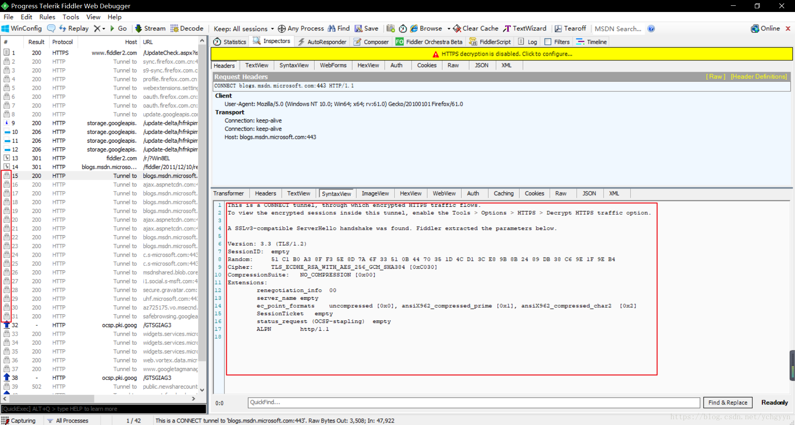

### 2. HTTPS的支持

​	Fiddler是HTTP代理，它位于客户端和服务器端之间。安装好Fiddler后直接可以对HTTP协议进行抓包。但很多时候我们也想对HTTPS的协议进行抓包分析，如果没有进行任何的配置就想用Fiddler来抓包分析是实现不了的，抓出来的是看不懂的加密内容。如下配置Fiddler，使其能够抓取HTTPS协议的包。

步骤1: 打开fiddler，配置https选项

打开fiddler，选择tools（工具）中的options（选项），勾选如下参数，截图如下:

​	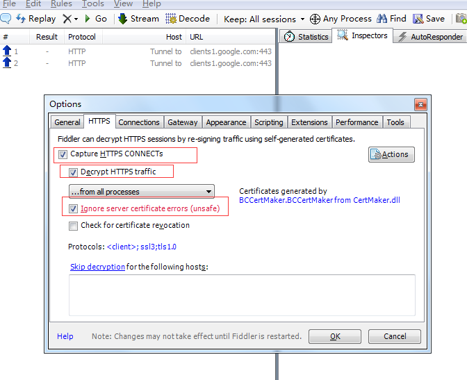

步骤2：生成证书

点击Actions，再弹出的框中选择Export Root Certificate to Desktop，这时候桌面上会出现证书FiddlerRoot.cer文件，点击OK设置成功，关闭fiddler。

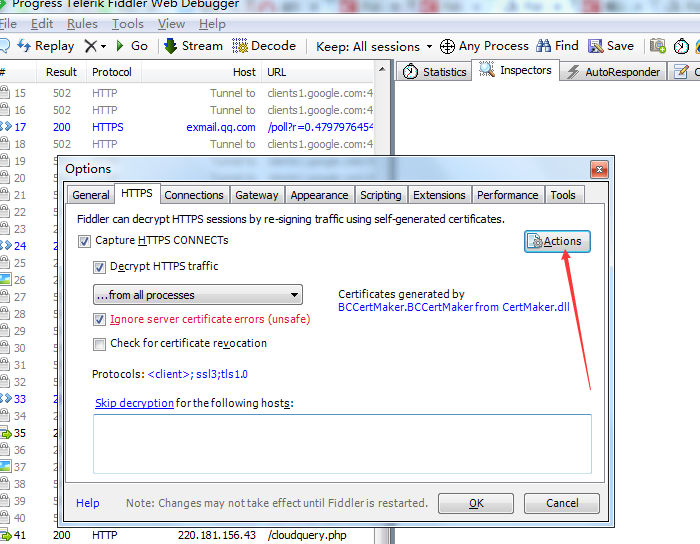

步骤3：配置信任的证书

​		在浏览器中导入证书FiddlerRoot.cer，以谷歌浏览器为例说明，在浏览器上输入: chrome://settings/然后进入高级设置，点击管理证书，导入刚才导出到桌面上的证书文件FiddlerRoot.cer

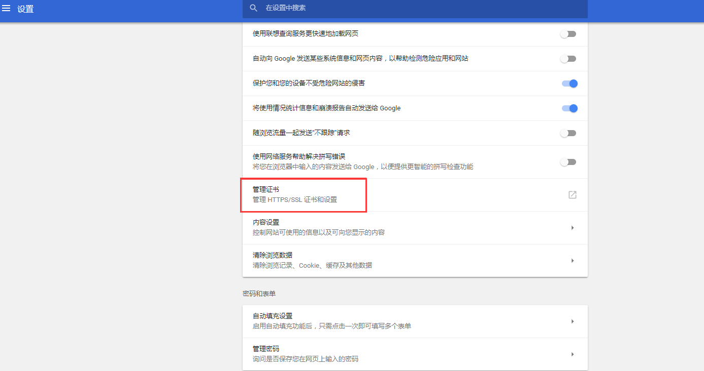

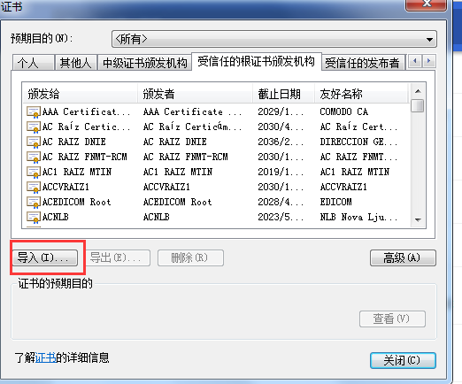

步骤4: 重新打开fiddler软件，即可抓取https协议

如果以上的步骤配置好以后，还是无法抓取https协议的包，则配置如下内容：

步骤1： 清除C:\Users\Administrator\AppData\Roaming\Microsoft\Crypto\RSA 目录下所有文件（首次安装fiddler请忽略）

步骤2：清除电脑上的根证书，WIN+R快捷键，输入：certmgr.msc， 然后回车，查找所有fiddler证书，然后删除。（首次安装fiddler请忽略）

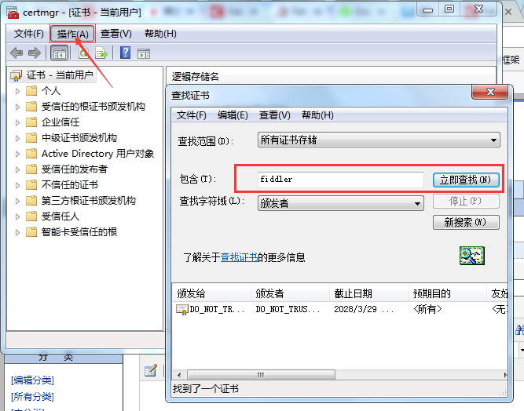

步骤3：清除浏览器上的证书文件 ,此处需要仔细查找带有FiddlerRoot的字样，并删除，以谷歌浏览器为例说明，在浏览器上输入: chrome://settings/，（首次安装fiddler请忽略）

步骤4：打开fiddler，点击工具栏中的Tools—>Options，点击Actions,选择最后一项，Reset All certificates,然后关闭。

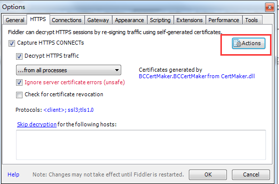

### 3. 豆瓣电影抓包分析

​		打开fildder软件后，在浏览器中访问豆瓣电影，地址为：https://movie.douban.com/explore#!type=movie&tag=%E7%83%AD%E9%97%A8&sort=recommend&page_limit=20&page_start=0，然后通过查看抓包工具fildder，可从软件中看到抓的接口请求情况和接口响应的内容。如下图所示：

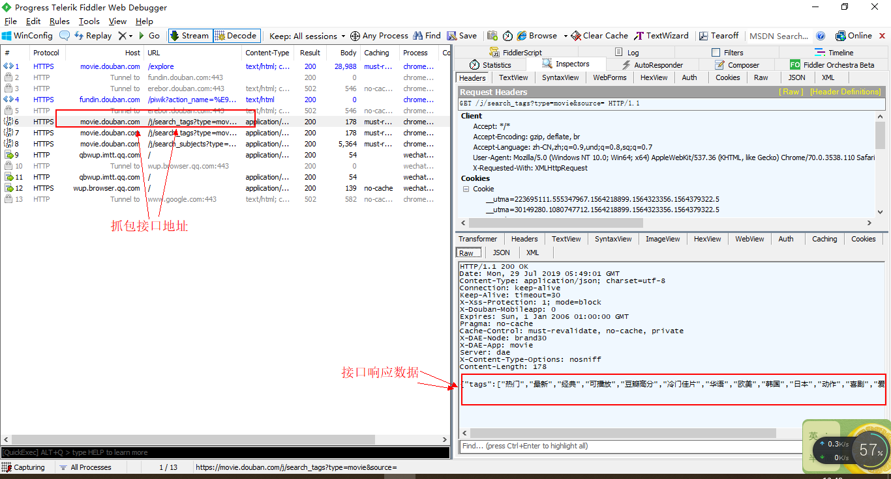

###  4. 手机APP抓包

​	利用fiddler抓取手机端端包，需要配置fiddler，让其允许远程连接。配置选项为Tools->Options->Connections，勾选Allow remote cpmputers to connect,可看见Fiddler监听端口是：8888；

​	点击ok后，重启fiddler客户端即可让远程手机端访问8888端口了。

fiddler抓取手机访问app中的包的实现步骤如下：

**步骤1:** 让手机和PC端处于同一网络下，然后更改手机的无线网代理，设置->无线局域网->点击已连接的无线网->找到HTTP代理（配置代理）->点击‘手动’，服务器：输入PC端ip地址，端口：输入fiddler端口，点击‘存储’即可。

1. 输入的PC端ip地址可在cmd中执行ipconfig命令进行查询。

2. 输入fiddler端口地址可在fiddler中设置，默认为8888端口。

**步骤2:** 手机端打开浏览器，输入http://ip:port（端口号是fiddler的端口号）。

如下图在手机端浏览器中访问 ip地址:port端口，如10.7.10.1:8888,可看到如下的截图：

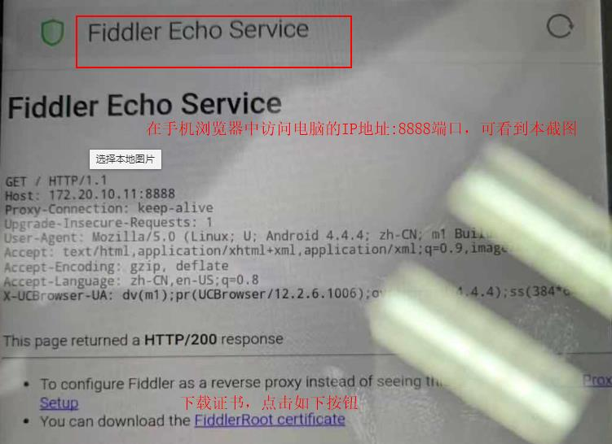

​    **注意：**在手机端展示如上图效果后，点击最下面的按钮，下载证书文件。

**步骤3:** 在手机中找到刚才下载好的证书文件，并点击‘确定’按钮。

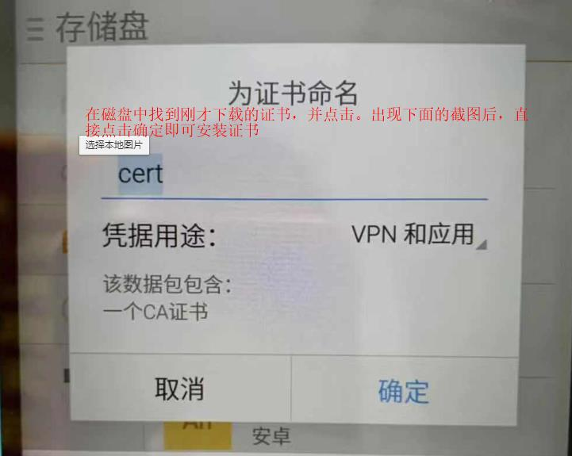

**步骤4:** 手机中访问网易云音乐，即可在fiddler中抓取到网易云发送到请求。从请求中找到content-type为audio的请求，该请求地址即为当前手机中播放的歌曲地址。然后再通过requests请求刚抓取到的地址，即可下载音乐内容。

抓取网易云app中某首歌曲截图如下：

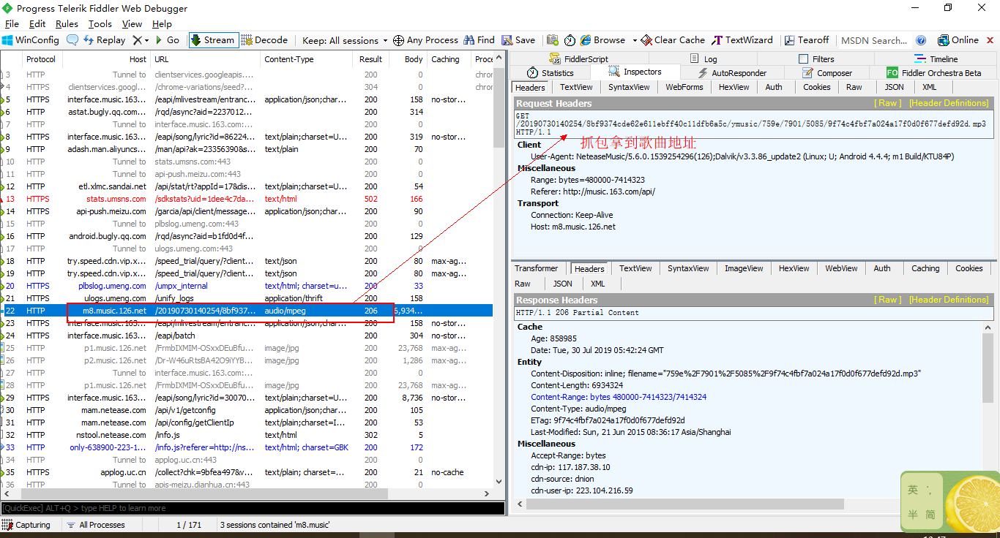

**注意：上图中抓取到的音乐地址为：m8.music.126.net/xxx/xxx/xxx地址**